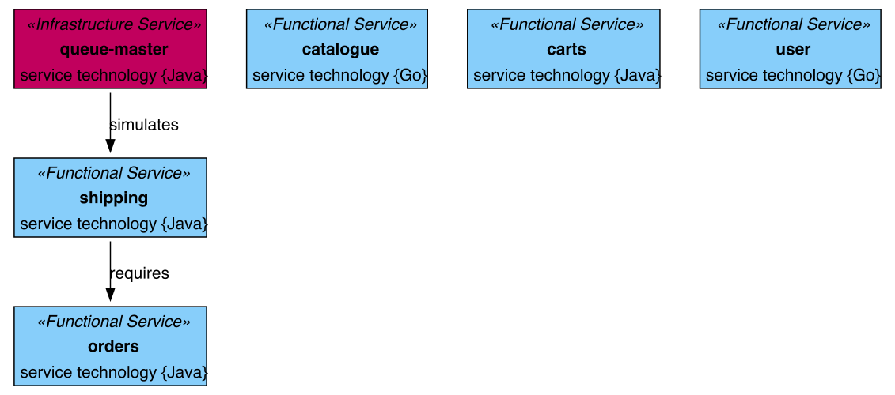
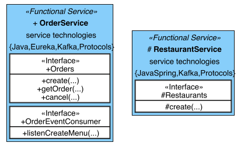

# LEMMA Visualizer

The **LEMMA Visualizer** is a tool to create a coherent visualization from multiple LEMMA intermediate service models. 
The visualization is based on the UML component diagram type and is 
implemented using GraphViz and LEMMA's own model processing framework. 

For further information on **LEMMA**  as a modeling ecosystem for engineering microservices, 
visit [here](https://github.com/SeelabFhdo/lemma).

## Usage

### Requirements

The following software must be installed on your machine.

- Java >=11
- GraphViz

### Instructions

The **LEMMA Visualizer** ships as a standalone runnable jar-file with a command line interface.
That is, it can be run using the terminal in the following manner.

```bash
java -jar de.fhdo.lemma.model_processing.visualizer-0.8.6-SNAPSHOT-standalone.jar
-i="path/to/initialservicemodel/model.xmi"
-t="path/to/output"
code_generation ServicesToGraphVizGenerator
-height=1000
-lvl=SIGNATURES
-aim="path/to/additionalmodels"
"Restaurant.xmi"
"AnotherServiceModel.xmi"
```

In the following, we explain the (admitted) long command.

As the application is based on [LEMMA's  model processing framework](https://github.com/SeelabFhdo/lemma/tree/main/examples/model-processing), it uses the same parameters and extends them as described in the following.

```bash
(...)
-i="path/to/initialservicemodel/model.xmi"
-t="path/to/output"
code_generation ServicesToGraphVizGenerator
(...)
```

`-i` is the relative path to the initial LEMMA intermediate service model. 
This parameter is mandatory, otherwise LEMMA's model processor will not execute the generation phase for service models.  

`-t` is the relative path for the output that is created, that is, a `.dot`  as well as a `.png` file.

`code_generation ServicesToGraphVizGenerator` tells the framework, that the code_generation phase with the given generator should be executed.

Afterwards, the CLI takes special parameters for the visualizer.

```bash
(...)
-height=1000
-lvl=SIGNATURES
-aim="path/to/additionalmodels"
"Restaurant.xmi"
"AnotherServiceModel.xmi"
"AThirdServiceModel.xmi"
```

`-height` describes the height of the image that is generated as an output. If not set, the value is 2000 px.

`-lvl` allows the configuration of the detail level each service should be depicted. Possible values are
`SERVICES` (least information displayed), `INTERFACES` (default value), `OPERATIONS`, `SIGNATURES` (most information displayed).

`-aim` finally allows the addition of more than the initial intermediate service model. 
It takes a relative folder path where the model files should be located. 
Afterwards, as many additional intermediate service models as desired can be added with there file name.

### Behind the Curtain

The Visualizer is currently in a prototypical stage as a research tool. Therefore, the CLI feels kind of clumsy. 
In the future we plan to at least combine some parameters making the usage easier.

#### How it works?
The Visualizer basically works by having the LEMMA model processor deserialize 
the initial xmi intermediate model and, thus, make it accessible. 
In essence, for each service found in the intermediate model, a node is created in a directed graph. 
The [JGraphT](https://jgrapht.org/) framework is used for this purpose. 
Subsequently, any additional intermediate models are read in and also added to the graph as vertices. 
Require relationships in the respective microservices are transferred as edges in the graph.
The graph is then exported to the `.dot` format and the graph is generated 
from the [.dot](https://graphviz.org/doc/info/lang.html) representation using GraphViz. 
To display the microservice information within the nodes, 
the ability to style GraphViz vertices with HTML is used.

## Example

### Image

The following images shows an example graph. 
Its generation is build in and can be triggered using the following command.

```bash
java -jar de.fhdo.lemma.model_processing.visualizer-0.8.6-SNAPSHOT-standalone.jar
-i="exampleModels/intermediate/service models/Order.xmi"
-t="exampleOutput"
code_generation ServicesToGraphVizGenerator
--example=true
```

`--example=true` is a special build-in toggle that basically skips all generation and uses a
hard coded service example inspired by the [sock shop](https://microservices-demo.github.io/) microservice example application.

### .dot file

```
# see exampleModels/sockshop-example.dot

strict digraph G {
  "sockshop.orders" [ label=<<table bgcolor='#87cefa' border='1' cellborder='0'><tr><td><i>&laquo;Functional Service&raquo;</i></td></tr><tr><td> <b>orders</b></td></tr><tr><td>service technology {Java}</td></tr></table>> type="FUNCTIONAL" shape="plaintext" color="black" fontname="Helvetica" ];
  "sockshop.catalogue" [ label=<<table bgcolor='#87cefa' border='1' cellborder='0'><tr><td><i>&laquo;Functional Service&raquo;</i></td></tr><tr><td> <b>catalogue</b></td></tr><tr><td>service technology {Go}</td></tr></table>> type="FUNCTIONAL" shape="plaintext" color="black" fontname="Helvetica" ];
  "sockshop.shipping" [ label=<<table bgcolor='#87cefa' border='1' cellborder='0'><tr><td><i>&laquo;Functional Service&raquo;</i></td></tr><tr><td> <b>shipping</b></td></tr><tr><td>service technology {Java}</td></tr></table>> type="FUNCTIONAL" shape="plaintext" color="black" fontname="Helvetica" ];
  "sockshop.carts" [ label=<<table bgcolor='#87cefa' border='1' cellborder='0'><tr><td><i>&laquo;Functional Service&raquo;</i></td></tr><tr><td> <b>carts</b></td></tr><tr><td>service technology {Java}</td></tr></table>> type="FUNCTIONAL" shape="plaintext" color="black" fontname="Helvetica" ];
  "sockshop.user" [ label=<<table bgcolor='#87cefa' border='1' cellborder='0'><tr><td><i>&laquo;Functional Service&raquo;</i></td></tr><tr><td> <b>user</b></td></tr><tr><td>service technology {Go}</td></tr></table>> type="FUNCTIONAL" shape="plaintext" color="black" fontname="Helvetica" ];
  "sockshop.queue-master" [ label=<<table bgcolor='#c1005d' border='1' cellborder='0'><tr><td><i>&laquo;Infrastructure Service&raquo;</i></td></tr><tr><td> <b>queue-master</b></td></tr><tr><td>service technology {Java}</td></tr></table>> type="INFRASTRUCTURE" shape="plaintext" color="black" fontname="Helvetica" ];
  "sockshop.queue-master" -> "sockshop.shipping" [ label="simulates" fontname="Helvetica" ];
  "sockshop.shipping" -> "sockshop.orders" [ label="requires" fontname="Helvetica" ];
}
```



For further experimentation this repository contains two pre-generated LEMMA service models located in `exampleModels/intermediate/service models`.
For example, you can use both models to generate the following `.dot` graph description and visualization (generated with `-height=250 -lvl=OPERATIONS`).

```
# see exampleModels/order-restaurant-example.dot

strict digraph G {
  "Order::org.example.OrderService" [ label=<<table bgcolor='#87cefa' border='1' cellborder='0'><tr><td><i>&laquo;Functional Service&raquo;</i></td></tr><tr><td>+ <b>OrderService</b></td></tr><tr><td><table bgcolor='white' cellspacing='0'><tr><td>&laquo;Interface&raquo;<br/>+Orders</td></tr><tr><td>+create(...)<br/>+getOrder(...)<br/>+cancel(...)<br/></td></tr></table></td></tr><tr><td><table bgcolor='white' cellspacing='0'><tr><td>&laquo;Interface&raquo;<br/>+OrderEventConsumer</td></tr><tr><td>+listenCreateMenu(...)<br/></td></tr></table></td></tr></table>> type="FUNCTIONAL" shape="plaintext" color="black" fontname="Helvetica" ];
  "Restaurant::org.example.RestaurantService" [ label=<<table bgcolor='#87cefa' border='1' cellborder='0'><tr><td><i>&laquo;Functional Service&raquo;</i></td></tr><tr><td># <b>RestaurantService</b></td></tr><tr><td><table bgcolor='white' cellspacing='0'><tr><td>&laquo;Interface&raquo;<br/>#Restaurants</td></tr><tr><td>#create(...)<br/></td></tr></table></td></tr></table>> type="FUNCTIONAL" shape="plaintext" color="black" fontname="Helvetica" ];
}
```



## Building Instructions
To build the visualizer from scratch, you can import the sources as a gradle project in your IDE.
You need the LEMMA maven packages in your repository. To do so, you can build LEMMA locally on your machine. 


## Disclaimer
This research tool was created by [Jonas Sorgalla](https://github.com/josor001) 
as part of his research concerning the empowerment of collaboration in microservice engineering. 
It is not meant to be used in production.

The LEMMA Visualizer is licensed under [MIT](https://choosealicense.com/licenses/mit/).